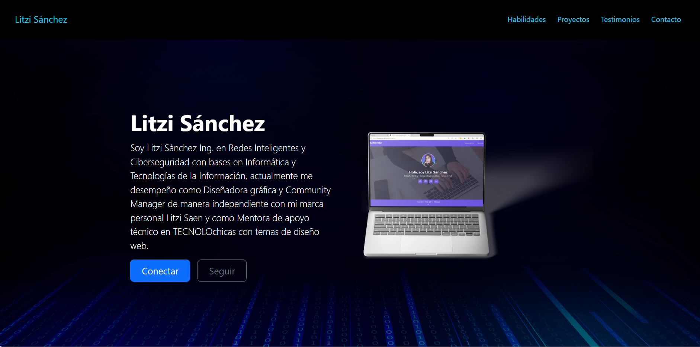
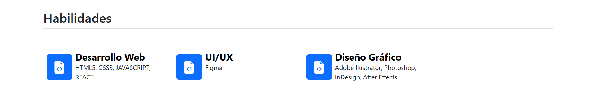
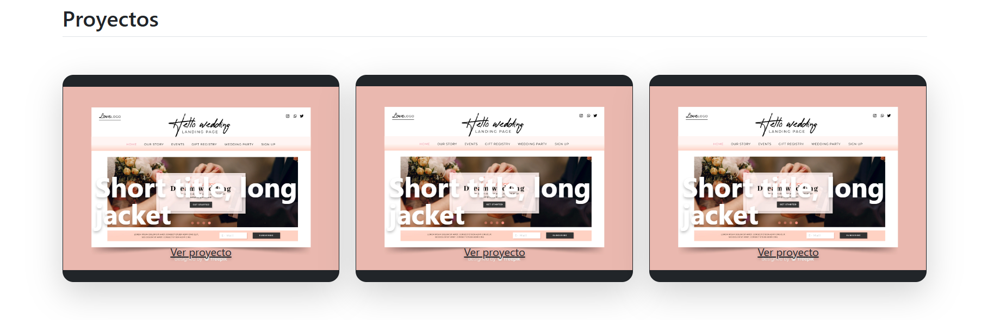
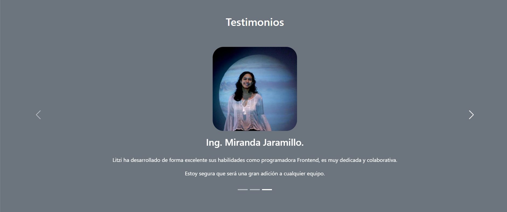

# 💻 Portafolio de actividades TECNOLOCHICAS PRO

El presente proyecto es un portafolio desarrollado para poner en práctica las habilidades obtenidad dentro del bootcamp de desarrollo frontend de Technolochicas PRO.

Fue desarrollado con HTML, CSS y JS con el uso de el framework de UI, Bootstrap utilizando además bibliotecas externas.

La página es responsiva (adaptable a diferentes tamaños de pantalla) e incluye la presentación de la autora del proyecto.

[Proyecto Desplegado](https://github.com/LitziSanchez)

## Secciones de mi sitio
* Presentacion

* Habilidades

* Proyectos

* Testimonios

* Contacto

## Tecnologías
* HTML5
* CSS3
* Bootstrap
* Javascript

Desarrollado con 💖 por [Litzi Sánchez](https://github.com/LitziSanchez) en [Tecnolochicas Pro](https://tecnolochicas.mx/)